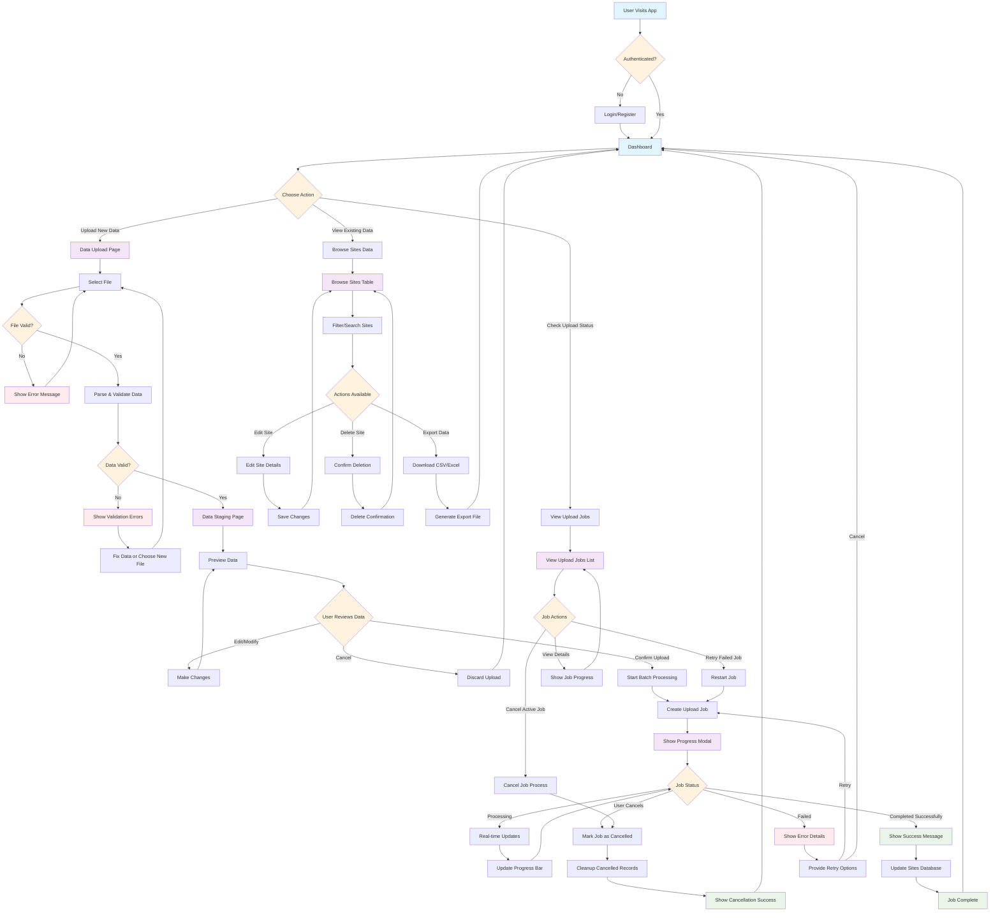

# Dynalis User Flow Diagram

## Key User Journey Paths

### Primary Upload Flow
1. **Authentication** → Dashboard → Data Upload
2. **File Selection** → Validation → Data Staging
3. **Review & Confirm** → Batch Processing → Real-time Monitoring
4. **Completion** → Return to Dashboard

### Data Management Flow
1. **Dashboard** → Browse Sites Data
2. **Search/Filter** → Edit/Delete/Export
3. **Save Changes** → Return to Browse

### Job Monitoring Flow
1. **Dashboard** → View Upload Jobs
2. **Job Details** → Cancel/Retry Actions
3. **Status Updates** → Return to Dashboard

### Error Handling Paths
- File validation errors → Re-upload
- Data validation errors → Fix and re-stage
- Processing failures → Retry or cancel
- Job cancellation → Cleanup and return

## Real-time Features
- Live progress updates during batch processing
- Job status monitoring with WebSocket connections
- Cancellation capabilities with proper cleanup
- Background processing with user feedback